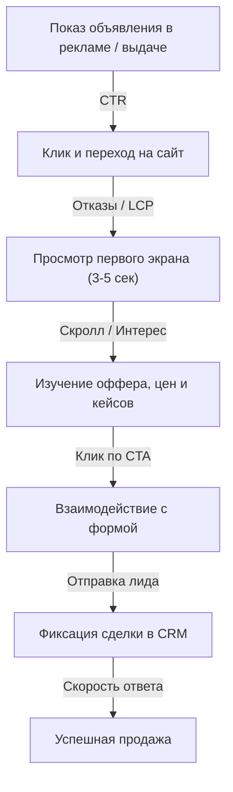

# Почему с сайта нет заявок: 10 скрытых причин и пошаговое руководство по исправлению конверсии

Предприниматель открывает рекламный кабинет: бюджет откручивается, счетчик фиксирует две тысячи переходов в неделю, кликабельность (CTR) в норме. Затем он заглядывает в CRM – там пустота. Ни одной новой сделки, ни одного звонка. Первая реакция большинства собственников – обвинить директолога или таргетолога: «Вы привели не тех людей, трафик мусорный, верните деньги».

В 8 случаях из 10 проблема кроется не в рекламных настройках. Трафик приходит на посадочную страницу, но наталкивается на глухую стену: невнятный заголовок, перегруженную форму, скрытые цены или технический сбой валидации номера телефона на смартфонах.

Сайт – это не статичная визитка, а фильтр и проводник. Если в этой цепочке сломано хотя бы одно звено, деньги на рекламу сгорают впустую.

Ниже мы разберем системную анатомию проблемы: почему пользователи просматривают страницы, но закрывают вкладку без заявки, как локализовать точку слива бюджета и какой пошаговый план вернет площадке стабильную генерацию лидов.

---

## Нет спроса или сломана конверсия: базовое разделение проблемы

Прежде чем переписывать заголовки и менять дизайн кнопок, определите, на каком уровне произошел разрыв. Все причины отсутствия лидов делятся на две принципиальные категории:

1. **Проблема рынка и продукта (внешний контур):** услуга не востребована, сезон закончился, либо ценник в полтора раза выше среднерыночного при полном отсутствии аргументов. В этом случае даже идеальный лендинг покажет нулевой результат.
2. **Проблема конверсионного пути (внутренний контур):** продукт рыночный, интерес у аудитории есть, но сайт не выполняет задачу закрытия сомнений. Человек заходит, не находит ответа за первые 5 секунд и уходит к конкурентам.

Чтобы отделить одно от другого, взгляните на три метрики в Яндекс Метрике:

- **Глубина просмотра и время на сайте.** Если среднее время визита составляет 10–15 секунд, а показатель отказов превышает 65% – посетители не понимают, куда попали. Чаще всего это типичные [смысловые ошибки на первом экране](/ru/blog/smyclovye-oshibki/), из-за которых сайт теряет клиента в первые мгновения.
- **Взаимодействие с контентом.** Если пользователи проводят на странице больше полутора минут, прокручивают до раздела цен, но не кликают по целевым кнопкам – проблема в доверии, прозрачности условий или самом оффере.
- **Движение внутри форм и курсора.** Паттерны поведения наглядно видны в Вебвизоре: о том, как их распознавать, читайте в разборе [7 скрытых поведенческих сигналов пользователей](/ru/blog/povedencheskie-signaly-net-zayavok/).

---

## 10 главных причин, почему сайт не приносит заявки

<figure style="margin-block: 2rem; text-align: center;">
  
  <figcaption style="font-size: 0.85rem; color: #6B6B6B; margin-top: 0.75rem;">Инфографика: Матрица экспресс-диагностики «Симптом в поведении – Истинная причина – Точечное решение»</figcaption>
</figure>

### 1. Слабый оффер и абстрактное УТП на первом экране

Пользователь решает, остаться ли на странице, за 3–5 секунд. Если в главном заголовке H1 написаны лозунги «Надежный партнер для вашего успеха», «Европейское качество по доступным ценам» или «Мы работаем с 2012 года», посетитель не считывает суть предложения.

- **Как делать не надо:** «Комплексные логистические решения для любого бизнеса».
- **Как делать правильно:** «Доставка грузов от 100 кг из Китая в Москву за 14 дней с таможенным оформлением под ключ».

Конверсионный оффер всегда отвечает на четыре конкретных вопроса: **что это**, **для кого**, **какой измеримый результат** и **в какие сроки / на каких условиях**. Подробный разбор формул и примеров смотрите в отдельной статье про [слабый оффер и слепой первый экран](/ru/blog/slabyj-offer-i-pervyj-ekran/).

### 2. Разрыв ожиданий между рекламой и посадочной страницей

Типичная ошибка кампаний: контекстное объявление обещает «Аренда мини-экскаватора от 12 000 руб/смена с доставкой за 2 часа», а клик ведет на общую главную страницу компании, где в первом блоке рассказывается об истории завода и автопарке из 50 машин.

Посетитель не станет блуждать по меню в поисках нужной модели. Не найдя за пару секунд обещанной цены и условий, он нажимает стрелку «Назад» в браузере. Каждая рекламная группа должна вести на посадочную страницу с синхронным заголовком.

### 3. Отсутствие цен и страх «кота в мешке»

Формулировка «Цена по запросу» или «Уточняйте у менеджера» в B2B и сфере услуг в 2026 году воспринимается как попытка навязать агрессивный холодный звонок. Покупатель подсознательно делает вывод: либо здесь заоблачно дорого, либо с ним будут торговаться.

Если точную стоимость услуги нельзя назвать без детального технического задания, покажите:
- Диапазон цен («От 45 000 до 120 000 рублей в зависимости от площади»);
- Примеры смет реальных выполненных проектов;
- Интерактивный калькулятор с прозрачной формулой расчета.

### 4. Непроходимые формы захвата

Каждое дополнительное поле в форме ввода снижает конверсию на 8–15%. Требование указать фамилию, отчество, юридический адрес, индекс и прикрепить реквизиты компании на этапе первого касания убивает заявки.

Оставьте только два обязательных поля: **телефон** (или удобный мессенджер) и **имя**. Для длинных B2B-опросников лучше использовать [технику «хлебных крошек» (Breadcrumb Technique)](/ru/blog/breadcrumb-technique/), разделяющую форму на легкие микрошаги. Все типичные интерфейсные ловушки мы разобрали в статье про [ошибки в формах и технические барьеры](/ru/blog/oshibki-v-formah-i-tehnicheskie-baryery/).

### 5. Технические сбои и скрытые баги верстки

Сайт может выглядеть безупречно на рабочем 27-дюймовом мониторе дизайнера в Safari, но выдавать критические ошибки на Android-смартфоне через Google Chrome. 

Среди скрытых технических барьеров чаще всего встречаются:
- Несрабатывающий скрипт отправки формы (AJAX-запрос возвращает 500 ошибку без вывода сообщения для пользователя);
- Слишком жесткая маска номера телефона (пользователь не может вставить скопированный номер или стереть неверную цифру);
- Невидимая Google reCAPTCHA, которая ошибочно блокирует отправку заявки с мобильного интернета;
- Кнопка закрытия всплывающего окна (крестик), которая вылезает за границы видимости экрана смартфона и блокирует доступ ко всему сайту.

### 6. Дефицит социальных доказательств и фактуры (синдром E-E-A-T)

Фразы «Нам доверяют тысячи клиентов» без подтверждений вызывают обратный эффект – настороженность. Современный пользователь скептичен. Ему нужны твердые доказательства опыта:

- Реальные фотографии производственного цеха или команды вместо картинок со стоков с улыбающимися моделями в галстуках;
- Кейсы по формуле «Было $\rightarrow$ Что сделали $\rightarrow$ Стало в цифрах» с указанием сферы бизнеса клиента;
- Отзывы на бланках с печатями, скриншоты переписок в Telegram или ссылки на видео-отзывы;
- Сертификаты, лицензии, реквизиты юридического лица в футере.

### 7. Медленная загрузка и тяжелый код

Каждая лишняя секунда ожидания первого экрана увеличивает отток аудитории. По данным исследований Google, при увеличении времени загрузки с 1 до 3 секунд вероятность отказа вырастает на 32%, а до 5 секунд – на 90%.

Если сайт собран на перегруженном шаблоне с десятками внешних плагинов, несжатыми изображениями по 8 Мб и тяжелыми анимациями, мобильный пользователь просто закроет вкладку, не дождавшись отрисовки. Время загрузки критического контента (LCP) не должно превышать 2.5 секунд. В такой ситуации перед бизнесом часто встает дилемма: [переделать сайт полностью или оптимизировать существующий](/ru/blog/peredelat-sajt-polnostyu-ili-optimizirovat/).

### 8. Отсутствие альтернативных каналов связи

Не каждый потенциальный клиент готов разговаривать по телефону. Предприниматели, занятые специалисты и молодое поколение предпочитают решать вопросы текстовыми сообщениями.

Если единственная кнопка на сайте – «Заказать звонок», вы добровольно срезаете до 40% целевых обращений. Внедрите возможность написать в Telegram или WhatsApp в один клик.

### 9. Слишком сложная терминология и продажа процесса вместо пользы

Многие эксперты и узкоспециализированные компании пишут тексты на профессиональном жаргоне. В результате страницу понимает только автор текста, но не клиент, у которого болит конкретная прикладная задача.

Покупатель покупает не «аппаратно-программный комплекс предиктивной вибродиагностики», а «предотвращение аварийной остановки конвейера и экономию от 2 млн рублей в год». Говорите на языке выгод и решений читателя.

### 10. Саботаж на этапе обработки: «заявка есть, но ее никто не заметил»

Парадоксальная, но частая ситуация: технически заявки уходят с сайта без сбоев, но падают в спам-папку корпоративной почты, либо менеджеры перезванивают клиенту через 6 часов.

Если с момента отправки формы до первого звонка проходит больше 15 минут, вероятность закрыть сделку падает в 4 раза. Клиент в этот момент уже открыл три соседние вкладки в выдаче и договорился с компанией, которая перезвонила за 90 секунд.

---

## Сквозная цепочка конверсии: где именно теряются клиенты

Конверсия – это не однократное действие, а последовательный фильтр. Представьте воронку взаимодействия:

Если на любом из этих стыков падение превышает норму, вся цепочка разваливается. Чтобы починить генерацию заявок, важно последовательно протестировать каждый отрезок.

---

## Пошаговый план: как вернуть заявки сайту за 5 дней

### День 1: Техническая ревизия и аудит форм
- Проверьте доступность сайта через PageSpeed Insights и валидаторы разметки.
- Отправьте 5 тестовых заявок со всех типов устройств: iPhone, Android, ноутбук, планшет.
- Проверьте, доходят ли уведомления в Telegram-бота компании, на почту и в воронку CRM.

### День 2: Чистка первого экрана и пересборка оффера
- Замените абстрактный заголовок на четкую формулу выгод.
- Добавьте визуализацию продукта или результата услуги (настоящие фото, видеофрагменты, схему).
- Проверьте релевантность: ведет ли реклама конкретного товара на соответствующую карточку или раздел.

### День 3: Внедрение твердых доказательств и цен
- Опубликуйте хотя бы 3 подробных кейса с цифрами, сроками и фотографиями процесса.
- Откройте ценовую вилку или базовые пакеты услуг.
- Добавьте блок «Что происходит после отправки заявки» (например: «Менеджер свяжется с вами в течение 10 минут в WhatsApp, ответит на вопросы и пришлет пример сметы»).

### День 4: Упрощение путей связи
- Сократите все формы на сайте до 2 обязательных полей.
- Подключите кнопки перехода в Telegram и WhatsApp.
- Уберите агрессивные всплывающие окна, перекрывающие экран в первые секунды визита.

### День 5: Анализ поведенческих микросигналов и запуск теста
- Настройте цели в Яндекс Метрике на отправку каждой формы и клики по мессенджерам.
- Откройте Вебвизор и отсмотрите не менее 30 сессий пользователей с рекламного трафика.
- Зафиксируйте места, где курсор замирает, мечется или резко покидает страницу.

Если вам нужен сжатый регламент для самостоятельной экспресс-проверки прямо сейчас, используйте наш готовый [чек-лист аудита конверсии за 1 день](/ru/blog/poshagovyj-audit-konversii-cheklist/).

---

## Персонализированный аудит от Ульяны Кирпичниковой

Если вы вложили сотни тысяч рублей в трафик, сменили трех подрядчиков по рекламе, а заявок по-прежнему единицы – причина почти всегда лежит в смысловой архитектуре сайта. 

Я провожу комплексный аудит конверсии сайтов и посадочных страниц:
- Нахожу скрытые технические и поведенческие точки утечки бюджета;
- Пересобираю оффер и структуру первого экрана под реальную психологию принятия решений в вашей нише;
- Разрабатываю чистые, адаптивные интерфейсы на Astro и современном стеке, которые загружаются за доли секунды и стабильно конвертируют холодный трафик в диалог.

Если вам нужен объективный разбор воронки без абстрактных советов – свяжитесь со мной на [ulyanaweb.ru](https://ulyanaweb.ru) или напишите напрямую в Telegram: [@ulyanakir](https://t.me/ulyanakir).

---

## Вопросы и ответы (SEO FAQ)

### Какая конверсия сайта считается нормальной в B2B и услугах?
Средняя конверсия посадочных страниц в сфере услуг и B2B составляет от 1.5% до 4%. Для сложных продуктов с высоким чеком конверсия в 1% может быть отличным показателем при высокой маржинальности. В сегментах с быстрым решением (эвакуаторы, срочный ремонт) конверсия качественного сайта может достигать 8–12%.

### Стоит ли скрывать цены, чтобы клиенты чаще звонили для консультации?
В 90% случаев сокрытие цен снижает конверсию. Пользователи закрывают вкладку и уходят к тем конкурентам, у кого указана хотя бы начальная стоимость («от ... рублей»). Если точный расчет индивидуален, укажите вилку цен или разместите калькулятор параметров.

### Почему в рекламе много кликов, а в Яндекс Метрике время визита 0 секунд?
Это симптом либо бот-трафика и скликивания, либо крайне медленной скорости загрузки сайта. Если страница открывается дольше 4–5 секунд, мобильный пользователь нажимает кнопку отмены до того, как счетчик аналитики успеет инициализироваться.

### Сколько полей должно быть в идеальной форме заявки?
Не более двух: контакт (телефон или ник в мессенджере) и имя. Каждое дополнительное поле (e-mail, город, комментарий, выбор услуги из выпадающего списка) снижает готовность пользователя завершить действие на 10–15%.

### Как Вебвизор помогает найти причину отсутствия заявок?
Вебвизор записывает видео экрана реальных пользователей: движения мыши, скроллинг, клики и выделения текста. Если вы видите, что люди кликают по некликабельным элементам, не замечают кнопку отправки из-за слепоты к баннерам или бросают заполнение формы на поле ввода телефона, вы точно знаете, какой элемент интерфейса требует правок.
